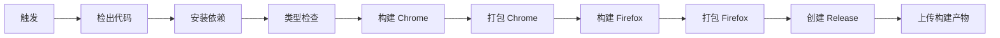

# GitHub Actions 工作流说明

## 📦 Release Workflow

自动构建和发布浏览器插件的 GitHub Actions 工作流。

### 触发方式

#### 1. 自动触发 (推荐)

当推送符合版本格式的 tag 时自动触发：

```bash
# 1. 更新 package.json 中的版本号
npm version patch  # 或 minor, major

# 2. 推送 tag 到 GitHub
git push origin v0.0.2  # 替换为实际版本号

# 或者一次性推送代码和 tags
git push --follow-tags
```

#### 2. 手动触发

1. 进入 GitHub 仓库页面
2. 点击 **Actions** 标签
3. 选择 **Build and Release** workflow
4. 点击 **Run workflow** 按钮
5. 输入版本号 (如 `v1.0.0`)
6. 点击 **Run workflow** 确认

### 工作流程



### 构建产物

每次成功构建会生成以下文件：

- **md-save-chrome.zip** - Chrome/Edge 浏览器插件
- **md-save-firefox.zip** - Firefox 浏览器插件

### Release 内容

GitHub Release 会包含：

1. **发布说明**
   - 包版本信息
   - 安装指南
   - 技术细节
   - 变更链接

2. **构建产物**
   - Chrome 版本 zip
   - Firefox 版本 zip

3. **构建缓存**
   - Actions artifacts (保留 90 天)
   - 便于调试和回滚

### 版本管理最佳实践

#### 语义化版本

遵循 [Semantic Versioning](https://semver.org/)：

- **MAJOR** (v1.0.0 → v2.0.0): 破坏性变更
- **MINOR** (v1.0.0 → v1.1.0): 新增功能,向后兼容
- **PATCH** (v1.0.0 → v1.0.1): Bug 修复

#### 发布流程示例

```bash
# 开发完成后
git add .
git commit -m "feat: add new feature"

# 更新版本号并创建 tag
npm version minor  # 生成 v0.1.0

# 推送到 GitHub 触发自动发布
git push --follow-tags
```

### 故障排查

#### 构建失败

1. **类型检查失败**
   ```bash
   # 本地先运行类型检查
   pnpm compile
   ```

2. **依赖安装失败**
   ```bash
   # 确保 pnpm-lock.yaml 已提交
   git add pnpm-lock.yaml
   git commit -m "chore: update lockfile"
   ```

3. **打包失败**
   ```bash
   # 本地测试完整构建流程
   pnpm build
   pnpm zip
   pnpm build:firefox
   pnpm zip:firefox
   ```

#### Release 创建失败

检查以下权限设置：

1. **Repository Settings** → **Actions** → **General**
2. 找到 **Workflow permissions**
3. 选择 **Read and write permissions**
4. 勾选 **Allow GitHub Actions to create and approve pull requests**

### 进阶配置

#### 自定义构建环境

修改 `.github/workflows/release.yml`:

```yaml
- name: Setup Node.js
  uses: actions/setup-node@v4
  with:
    node-version: '20'  # 修改 Node.js 版本
    cache: 'pnpm'
```

#### 添加 Slack 通知

```yaml
- name: Notify Slack
  if: success()
  uses: slackapi/slack-github-action@v1
  with:
    webhook-url: ${{ secrets.SLACK_WEBHOOK }}
    payload: |
      {
        "text": "Release ${{ steps.release-version.outputs.version }} published!"
      }
```

#### 添加测试步骤

```yaml
- name: Run tests
  run: pnpm test

- name: E2E tests
  run: pnpm test:e2e
```

### 监控和分析

#### 查看构建日志

1. **Actions** 标签页
2. 点击对应的 workflow run
3. 展开各个步骤查看详细日志

#### 下载构建产物

1. 进入成功的 workflow run 页面
2. 滚动到底部 **Artifacts** 区域
3. 下载 `extension-builds-vX.X.X`

### 相关文档

- [GitHub Actions 文档](https://docs.github.com/actions)
- [WXT 构建文档](https://wxt.dev/guide/essentials/building.html)
- [语义化版本规范](https://semver.org/)

---

**Last Updated**: 2025-01-13
